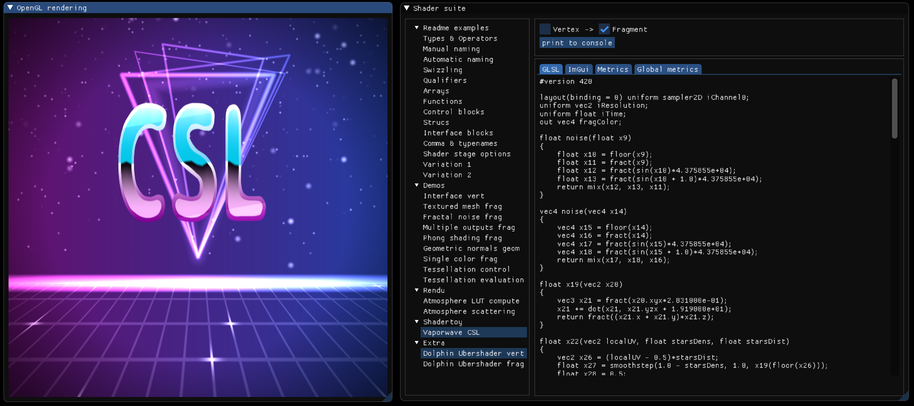

[](https://travis-ci.com/thonatt/CSL)
[](https://github.com/thonatt/CSL/blob/master/LICENSE)
[](https://github.com/thonatt/CSL)

# C++ integrated Shading Language

CSL is a C++ header-only library, self-transpiling into GLSL. It allows to write OpenGL shaders directly inside computer graphics applications code. The concept is that shader correctness is checked at compile-time by the C++ compiler, while a string corresponding to the GLSL code is produced at run-time by the graphic application. CSL can be considered as some kind of inlined GLSL compiler, meaning that if the shader should not compile, the application should not compile either. This project goals are to provide convenient and maintainable shader writing thanks to:

+ Having a syntax as close as possible to GLSL.
+ Having the shader code directly inside the C++ code.
+ Checking GLSL specification compliance at C++ compile-time as much as possible.
+ The possibility to use C++ as meta language for generic shader generation.

CSL requires a C++17 compliant compiler and does not require any external dependency. It built successfully using Visual Studio (Windows), Clang (Windows, Linux, Apple), and GCC (Linux, Apple).

This repo contains the [CSL source files](https://github.com/thonatt/CSL/tree/master/src/include) and a [shader suite application](#shader-suite), which shows and runs several CSL shaders, from didactic examples to more complex shaders.

CSL is a template-heavy library and compilation is currently noticeably slow. The run-time shader generation is however pretty fast. The whole shader suite, including all the examples present in this readme, takes approximately 5 ms to be generated. 

**Disclaimer** : This project is a work in progress and the current coverage of the different GLSL specifications is only partial. Many functions or language features are missing. The [syntax section](#csl-syntax) gives a nice overview of what is currently available. The goal is to first make possible what is legal in GLSL. In a second time, the goal will be to make impossible what is not valid in GLSL. 

# Setup

As CSL is a header-only library, the header files in the `CSL/src/include` are needed, and simple include of the file `<csl.hpp>` is enough to use it. Here is a small program, showing a vertex shader example and its corresponding output. CSL syntax is described in more detail in the [syntax section](#csl-syntax).

<table>
  <tr>
    <th>Code</th>
    <th>Output</th> 
  </tr>
  <tr>
    <td>
        
  ```cpp
#include <CSL/src/include/csl.hpp>
#include <iostream>

int main() {
      using namespace csl::vert_330;  
      Shader shader;

      Qualify<vec3, Layout<Location<0>>, In> position;

      shader.main([&]{
            gl_Position = vec4(position, 1.0);
      });

      std::cout << shader.str() << std::endl;
}
```
   </td>
    <td>
  
```cpp
   #version 330

   layout(location = 0) in vec3 position;

   void main()
   {
      gl_Position = vec4(position, 1.0);
   }
```
   </td> 
  </tr>
</table>

For readability purposes, all outputs are shown as if the code used named variables. Please check the [naming variables](#naming-variables) section for more details about the actual output.

# Shader suite



The CSL shader suite is an application showcasing a collection of shaders written in CSL. For each shader, the application provides the output GLSL string, some metrics about runtime performances, and a way to explore the shader expression tree using [ImGui](https://github.com/ocornut/imgui). It also allows to see several shaders in action, thus serving as a practical test suite. 

## Building

First clone the repo and its dependencies:

```
git clone --recursive https://github.com/thonatt/CSL.git
cd CSL
git submodule update --init
```

The shader suite can be then built using [CMake](https://cmake.org/):

```
cd src\shader_suite\
mkdir build
cd build
cmake --help ## optional - for checking available generators
cmake .. -G "Your picked generator" ## e.g "Visual Studio 16 2019"  
```

Finally compile and run the application:

```
cmake --build . --config Release
.\bin\Release\CSL_ShaderSuite.exe
```

# Credits

Developped by [Théo Thonat](https://github.com/thonatt), initially from shader writing induced frustration, but in the end mostly to learn advanced template programming and explore C++ dark corners.

Special thanks to [Simon Rodriguez](https://github.com/kosua20) for decisive and positive feedback about the initial project concept, the help with compilers cross-checking, and for many of the shaders examples.

# CSL syntax

As GLSL and C++ share a common C base language, their syntax are quite similar. However, the goal of CSL is to write C++ code that can perform introspection, while keeping a syntax close to GLSL, meaning that some tradeoffs had to be made. This section covers the subtleties of the CSL syntax (hopefully nothing too repulsive !). It is also a summary of what is possible in CSL:

+ [Setup a shader](#shader-setup)
+ [Basic and Sampler types](#basic-and-sampler-types)
+ [Naming variables](#naming-variables)
+ [Operators and Swizzles](#operators-and-swizzles)
+ [Qualifiers and shader stage options](#qualifiers-and-shader-stage-options)
+ [Arrays and Functions](#arrays-and-functions)
+ [Building blocks](#building-blocks)
+ [Structs and Interface blocks](#structs-and-interface-blocks)
+ [Generic shader generation](#generic-shader-generation)

## Shader setup

Shader type and GLSL version are setup using a specific namespace. For example, `using namespace csl::vert_330` gives access to the built-in functions and built-in variables for a vertex shader with GLSL 3.30. Vertex, fragment, geometry, and tesselation shaders are currently supported. A [shadertoy](https://www.shadertoy.com/) namespace is also available.

Starting a new shader requires to create a variable of type `Shader`. This type contains two important member functions. The first one is `Shader::main` which allows to setup the main using a lambda function with no argument that returns nothing. The second one is `Shader::str`, which retrieves the `std::string` associated to the shader that can later be sent to the GPU. See the [previous section](#setup) for an example.

CSL assumes instructions are called sequentially so it is not thread-safe.

## Basic and Sampler types

CSL defines the types used in GLSL. Most CSL types have the exact same typename as their GLSL counterpart. For example, `void`, `vec3`, `ivec2`, `dmat4`, `mat4x3`, `sampler2DArray`, `uimageCube` are all valid types that can be used as is. The only exceptions are `double`, `float`, `int` and `bool` as they would conflict with C++ keywords. Valid associated CSL typenames are `Double`, `Float`, `Int`, `Bool` - and `Uint` to keep the consistency.

Constructors and declarations are identical to GLSL. CSL and C++ basic types can also be mixed.

<details>
    <summary>Show constructors example</summary>
<table>
  <tr>
    <th>Code</th>
    <th>Output</th> 
  </tr>
  <tr>
    <td>
        
  ```cpp
  Uint counter = 0;
  vec2 uv = vec2(1.0, 2.0);
  vec4 color = vec4(0.0, uv, Float(counter));
  bvec3 m = not(bvec3(!Bool(true), false, false));
```
</td>
    <td>
  
```cpp
	uint counter = 0;
	vec2 uv = vec2(1.0, 2.0);
	vec4 color = vec4(0.0, uv, float(counter));
	bvec3 m = bvec3(true, false, false);
```
</td> 
  </tr>
</table>
</details>

## Naming variables

Because C++ objects do not have names at runtime, it is not possible to directly forward the CSL variable names to the GLSL output. As a consequence, CSL will perfom automatic variable naming, which has a significant impact on the output shader readability.

<details>
    <summary>Automatic naming example</summary>
<table>
  <tr>
    <th>Code with automatic naming</th>
    <th>Actual output</th> 
  </tr>
  <tr>
  <td>
        
  ```cpp
  Qualify<vec3, In> normal;
  Qualify<vec3, In> position;
  Qualify<vec3, Uniform> eye;

  shader.main([&] {
    Float alpha = 1.2;
    vec3 V = normalize(eye - position);
    vec3 N = normalize(normal);

    Float result;
    result = alpha * dot(N, V);
  });
```
</td>
<td>
  
```cpp
in vec3 x4;
in vec3 x5;
uniform vec3 x6;

void main()
{
    float x8 = 1.2;
    vec3 x9 = normalize(x6 - x5);
    vec3 x10 = normalize(x4);
    float x11;
    x11 = x8*dot(x10, x9);
}

```
</td> 
</tr>
</table>
</details>

Therefore, it is possible to provide a name to any CSL variable. It can be done either when declaring a variable using the `(const std::string&)` constructor, or when initializing a variable using the `<<(const std::string&)` operator. Manual naming is rather cumbersome, but may be useful for certain cases such as:
+ Access to uniforms location with an explicit name.
+ Name consistency between vertex out and fragment in variables.
+ Output shader readability for debugging purposes.

<details>
    <summary>Same example with manual naming</summary>
<table>
  <tr>
    <th>Code with manual naming</th>
    <th>Actual output</th> 
  </tr>
  <tr>
    <td>
        
  ```cpp
	//naming during variable declaration
	Qualify<vec3, In> normal("normal");
	Qualify<vec3, In> position("position");
	Qualify<vec3, Uniform> eye("eye");

	shader.main([&] {
		//naming during variable initialisation
		Float alpha = Float(1.2) << "alpha";
		vec3 V = eye - position << "V";
		vec3 N = normalize(normal) << "N";

		//naming during variable declaration
		Float result("result");
		result = alpha * dot(N, V);
	});
```
</td>
  <td>
  
```cpp
in vec3 normal;
in vec3 position;
uniform vec3 eye;

void main()
{
    float alpha = 1.2;
    vec3 V = eye - position;
    vec3 N = normalize(normal);
    float result;
    result = alpha*dot(N, V);
}
```
</td> 
</tr>
</table>
</details>

## Operators and Swizzles

As C++ and GLSL share a common C base syntax, most of the operators keywords are identical and can be used as is. This includes for example:
+ `+`, `-`, `*`, `/` and their assignment operator counterparts,
+ `==`, `<`, `>` , `&&` and other binary relational or bitwise operators,
+ `[]` for component or row access, and for swizzling.

One exception is the ternary operator ` ? : `. Even if the synthax is similar between C++ and GLSL, it cannot be overloaded. Therefore it is replaced by a macro `CSL_TERNARY` with the 3 arguments.

Swizzles are GLSL-specific operators for verstatile vector components acces. In order to preserve all the swizzling possibilities while keeping the code simple, CSL uses global variables such as `x`, `y`, `z`, or `w`. The syntax for swizzle accessing is for example `myVec[x,z,x]`. To prevent namespace pollution, all those swizzle variables belong to a specific namespace corresponding to their swizzle set. Available namespaces are `csl::swizzles::xyzw`, `csl::swizzles::rgba`, `csl::swizzles::stpq`, and `csl::swizzles::all` which includes the previous three.

<details>
    <summary>Swizzle and operators examples</summary>
<table>
  <tr>
    <th>Code</th>
    <th>Output</th> 
  </tr>
  <tr>
    <td>
        
  ```cpp
using namespace csl::swizzles::rgba;
mat4 cols("cols");
vec4 col("col");
vec4 out("out");

cols[0] = CSL_TERNARY(col[a] > 0, col, 1.0 - col);

//can you guess what is actually assigned ?
out[a] = col[b, a, r][b, g][r];
```
</td>
    <td>
  
```cpp
mat4 cols;
vec4 col;
vec4 out;
cols[0] = col.a > 0 ? col : 1.0 - col;
out.a = col.bar.bg.r;
```
</td> 
  </tr>
</table>
</details>

## Qualifiers and shader stage options

Qualifiers can be added to a type in CSL by using the template class `Qualify`. Qualifiers are classes, and may be templated if they require values. For example, `Uniform` is a simple class, while `Layout` is a template class, with layout qualifiers types specified as template parameters. `Binding` is a template class, with binding value specified as an unsigned int parameter. CSL qualifiers names are identical to GLSL, except for beginning with an uppercase.

<details>
    <summary>Qualifiers examples</summary>
<table>
  <tr>
    <th>Code</th>
    <th>Output</th> 
  </tr>
  <tr>
    <td>
        
```cpp
	Qualify<vec4, Out> color;
	Qualify<vec3, Layout<Location<4>>, In> position;
	Qualify<sampler2DArray, Layout<Binding<0>>, Uniform, Array<8>> samplers;
```
</td>
    <td>
  
```cpp
out vec4 color;
layout(location = 4) in vec3 position;
layout(binding = 0) uniform sampler2DArray samplers[8];
```
</td> 
  </tr>
</table>
</details>

Shader stage options can be specified with the templated `in()` and `out()` built-in functions, using the template parameters as layout qualifiers.

<details>
    <summary>Shader stage option examples</summary>
<table>
  <tr>
    <th>Code</th>
    <th>Output</th> 
  </tr>
  <tr>
    <td>
        
```cpp
  //in a fragment shader
  in<Layout<Early_fragment_tests>>();

  //in a geometry shader
  in<Layout<Triangles>>();
  out<Layout<Line_strip, Max_vertices<2>>>();
```
</td>
    <td>
  
```cpp
layout(early_fragment_tests) in;
layout(triangles) in;
layout(line_strip, max_vertices = 2) out;
```

</td> 
  </tr>
</table>
</details>


## Arrays and Functions

Arrays in CSL are declared as qualifiers using the `Array` class, with size as parameter. A size of zero is used for implicitely sized GLSL arrays. Indexing is done with the usual `[]` operator. Multiple sizes can be provided as template parameters to define multidimensional arrays. 

<details>
    <summary>Array examples</summary>
<table>
  <tr>
    <th>Code</th>
    <th>Output</th> 
  </tr>
  <tr>
    <td>
        
  ```cpp
// array declaration
Qualify<vec3, Array<5>> vec3x5;

// array initialization
Qualify<Float, Array<0>> floatX = Qualify<Float, Array<0>>(0.0, 1.0, 2.0);

// multi dimensionnal arrays
Qualify<mat3, Array<2, 2>> mat3x2x2 = Qualify<mat3, Array<2, 2>>(
  Qualify<mat3, Array<2>>(mat3(0), mat3(1)),
  Qualify<mat3, Array<2>>(mat3(2), mat3(3)));

// usage
vec3x5[0] = floatX[1] * mat3x2x2[0][0] * vvec3x5[1];
```
</td>
    <td>
  
```cpp
vec3 vec3x5[5];
float floatX[] = float[](0.0, 1.0, 2.0);
mat3 mat3x2x2[2][2] = mat3[2][2](mat3[2](mat3(0), mat3(1)), mat3[2](mat3(2), mat3(3)));
vec3x5[0] = floatX[1]*mat3x2x2[0][0]*vec3x5[1];

```
</td> 
  </tr>
</table>
</details>

Functions in CSL are objects that can be created using the `define_function` template function with a C++ lambda as parameter. The return type must be explicitely specified as template parameter. Returns are declared using the `CSL_RETURN;` or `CSL_RETURN(expression);` syntax. Parameters can be named using default argument values. The function can be called later in the code using the usual `()` operator with valid arguments. Function overloading is possible in CSL by providing multiple return types and lambdas.

<details>
    <summary>Function examples</summary>
<table>
  <tr>
    <th>Code</th>
    <th>Output</th> 
  </tr>
  <tr>
    <td>
        
```cpp
// empty function
auto fun = define_function<void>([] {});

// named function with named parameters
auto add = define_function<vec3>("add",
  [](vec3 a = "a", vec3 b = "b") {
  CSL_RETURN(a + b);
});

// function with some named parameters
auto addI = define_function<Int>(
  [](Int a, Int b = "b", Int c = "") {
  CSL_RETURN(a + b + c);
});

// function calling another function
auto sub = define_function<vec3>([&](vec3 a, Qualify<vec3, Inout> b = "b") {
  fun();
  CSL_RETURN(add(a, -b));
});

// named function with several overloads
auto square = define_function<vec3, ivec3, void>("square",
  [](vec3 a = "a") {
  CSL_RETURN(a * a);
},
  [](ivec3 b = "b") {
  CSL_RETURN(b * b);
},
  [] { CSL_RETURN; }
);
```
</td>
    <td>
  
```cpp
void x4()
{
}

vec3 add(vec3 a, vec3 b)
{
    return a + b;
}

int x8(int x9, int b, int x11)
{
    return x9 + b + x11;
}

vec3 x12(vec3 x13, inout vec3 b)
{
    x4();
    return add(x13, -b);
}

vec3 square(vec3 a)
{
    return a*a;
}

ivec3 square(ivec3 b)
{
    return b*b;
}

void square()
{
    return;
}
```
</td> 
  </tr>
</table>
</details>

## Building blocks

Selection, iteration and jump statements are available in CSL. As C++ and GLSL share the same keywords, CSL redefines them using macros with the syntax `CSL_KEYWORD`, namely `CSL_FOR`, `CSL_CONTINUE`, `CSL_BREAK`, `CSL_WHILE`, `CSL_IF`, `CSL_ELSE`, `CSL_ELSE_IF`, `CSL_SWITCH`, `CSL_CASE`, and `CSL_DEFAULT`. Their behavior is mostly identical to C++ and GLSL. Here are some comments and a few limitations:
+ A `CSL_SWITCH` **must** contain a `CSL_DEFAULT` case, even if it happens to be empty.
+ CSL syntax for `case value :` is `CSL_CASE(value) :`.
+ Init, condition and loop in `CSL_FOR( init-expression; condition-expression; loop-expression)` must not contain more than one statement each. Any of these expressions can also be empty.
+ Variables declared in `CSL_FOR` args expressions outlive the scope of the `for` body. It is possible to prevent that by putting explicitly the whole for loop in a scope.
+ Statements can be nested

<details>
    <summary>Building blocks examples</summary>
<table>
  <tr>
    <th>Code</th>
    <th>Output</th> 
  </tr>
  <tr>
    <td>
        
```cpp
// Empty for
CSL_FOR(;;) { CSL_BREAK; }

// Named function with named parameters
CSL_FOR(Int i = Int(0) << "i"; i < 5; ++i) {
  CSL_IF(i == 3) {
    ++i;
    CSL_CONTINUE;
  } CSL_ELSE_IF(i < 3) {
    i += 3;
  } CSL_ELSE{
    CSL_FOR(; i > 1;)
      --i;
  }
}
// Not possible as i is still in the scope
//Int i; 

{
  CSL_FOR(Int j = Int(0) << "j"; j < 5;) {
    CSL_WHILE(j != 3) {
      ++j;
    }
  }
}
//OK since previous for was put in a scope
Int j("j");

CSL_SWITCH(j) {
  CSL_CASE(0) : { CSL_BREAK; }
  CSL_CASE(2) : { j = 3; }
  CSL_DEFAULT: { j = 2; }
}
```
</td>
    <td>
  
```cpp
for(;;) {
    break;
}
for(int i = 0; i < 5; ++i) {
    if (i == 3)
    {
        ++i;
        continue;
    }
    else if (i < 3)
    {
        i += 3;
    }
    else
    {
        for(;;) {
            --i;
        }
    }
}
for(int j = 0; j < 5; ) {
    while(j != 3) {
        ++j;
    }
}
int j;
switch(j) {
    case 0 : {
        break;
    }
    case 2 : {
        j = 3;
    }
    default : {
        j = 2;
    }
}
```
</td> 
  </tr>
</table>
</details>

## Structs and Interface blocks

CSL structs are declared using the syntax `CSL_STRUCT(StructTypename, member-list ...);`. As members in C++ have no way to know if they belong to a struct, CSL has to use some form of reflection, based on C++ preprocessor magic. So to help the preprocessor looping over the members, `member-list` has to be declared using extra parenthesis such as: `(Type1, member1), (Type2, member2), ...`

<details>
    <summary>Struct examples</summary>
<table>
  <tr>
    <th>Code</th>
    <th>Output</th> 
  </tr>
  <tr>
    <td>
        
```cpp
// struct declaration
CSL_STRUCT(Block,
  (mat4, mvp),
  (vec4, center)
);

// nested struct
CSL_STRUCT(BigBlock,
  (Block, inner_block),
  (vec4, center)
);

// usage
BigBlock big_block("big_block");
Block block = Block(mat4(1), vec4(0));

block.center = big_block.inner_block.mvp * big_block.center;
```
</td>
    <td>
  
```cpp
struct Block
{
    mat4 mvp;
    vec4 center;
};

struct BigBlock
{
    Block inner_block;
    vec4 center;
};

BigBlock big_block;
Block x5 = Block(mat4(1), vec4(0));
x5.center = big_block.inner_block.mvp*big_block.center;
```
</td> 
  </tr>
</table>
</details>

Nammed interface blocks are similar to structs with syntax `CSL_INTERFACE_BLOCK(qualifiers-list ..., Typename, Name, member-list ... );`. The `qualifiers-list` refers to the qualifiers associated to the block. In case multiple qualifiers as specified, extra parethesis must be put around the list. `Name` is name of the variable associated to the block. 

Unnamed interface blacks are declared using the syntax `CSL_UNNAMED_INTERFACE_BLOCK(qualifiers-list ..., Typename, member-list ...)`.
In that case, block members belong directly to the current scope. 

<details>
    <summary>Interface block examples</summary>
<table>
  <tr>
    <th>Code</th>
    <th>Output</th> 
  </tr>
  <tr>
    <td>
        
```cpp
// Unnamed interface
CSL_UNNAMED_INTERFACE_BLOCK(In, SimpleInterface,
  (Float, delta_time)
);

// Named array interface with multiple qualifiers
CSL_INTERFACE_BLOCK((Layout<Binding<0>>, Out, Array<3>), Output, out,
  (vec3, position),
  (vec3, velocity)
);

out[0].position += delta_time * out[0].velocity;
```
</td>
    <td>
  
```cpp
layout(binding = 0) out Output {
    vec3 position;
    vec3 velocity;
} out[3];

in SimpleInterface {
    float delta_time;
};

out[0].position += delta_time*out[0].velocity;
```
</td> 
  </tr>
</table>
</details>

Since the `qualifiers-list` and `member-list` are parsed by the preprocessor, **qualifiers and members typename must not contain any comma**. To circumvent this issue, either extra parenthesis must be added to help the preprocessor, or typename alias should be used.

<details>
    <summary>Type alias examples</summary>
<table>
  <tr>
    <th>Code</th>
    <th>Output</th> 
  </tr>
  <tr>
    <td>
        
```cpp
using vec4x16 = Qualify<vec4, Array<16>>;
CSL_INTERFACE_BLOCK(
  (Layout<Binding<0>, Std140>, Uniform, Array<2>), // extra parenthesis 
  MyInterface, vars,
  (vec4x16, vecs),								 // typename alias
  ((Qualify<mat4, Array<4>>), myMats)				 // extra parenthesis 
);
```
</td>
    <td>
  
```cpp
layout(binding = 0, std140) uniform MyInterface {
    vec4 vecs[16];
    mat4 myMats[4];
} vars[2];
```
</td> 
  </tr>
</table>
</details>

Since CSL must rely on a macro for structs and interface blocks, members names and interface block variable names can be directly forwarded to CSL. Therefore there is no need for either automatic or manual naming in those cases. 

## Generic shader generation

Regular C++ workflow can be used to help the generation of CSL shaders, such as changing values, manual unrolling or conditionnal expressions. The helper `std::integral_constant` can be used to pass `constexpr` parameters, which are useful for example to specify the size of an array. 

The use of C++ as a meta-languages for CSL has limitations. For example, CSL scopes are still C++ scopes under the hood, so CSL declarations do not outlive C++ scopes.

<details>
    <summary>Generic shader generation example</summary>
<table>
  <tr>
    <th>Code</th>
    <th>Output</th> 
  </tr>
  <tr>
    <td>
        
```cpp
template<typename T>
auto shader_variation(T&& parameter, std::array<double, 2> direction, bool gamma_correction)
{
	using namespace csl::glsl::frag_420;
	using namespace csl::swizzles::rgba;
	Shader shader;

	Qualify<sampler2D, Uniform> samplerA("samplerA"), samplerB("samplerB");
	Qualify<vec2, In> uvs("uvs");
	Qualify<vec4, Out> color("color");

	shader.main([&] {
		vec2 sampling_dir = vec2(direction[0], direction[1]) << "sampling_dir";

		constexpr int N = T::value;
		Qualify<vec4, Array<2 * N + 1>> cols("cols");

		CSL_FOR(Int i = Int(-N) << "i"; i <= N; ++i) {
			cols[N + i] = vec4(0);
			for (auto& sampler : { samplerA, samplerB }) {
				cols[N + i] += texture(sampler, uvs + Float(i) * sampling_dir);
			}
			color += cols[N + i] / Float(2 * N + 1);
		}

		if (gamma_correction) {
			color[r, g, b] = pow(color[r, g, b], vec3(2.2));
		}
	});

	return shader;
};

shader_variation(std::integral_constant<int, 9>{}, { 0, 1 }, true);
shader_variation(std::integral_constant<int, 5>{}, { 1, 0 }, false);
```
</td>
<td>
  
```cpp
#version 420

uniform sampler2D samplerA;
uniform sampler2D samplerB;
in vec2 uvs;
out vec4 color;

void main()
{
    vec2 sampling_dir = vec2(0.0, 1.0);
    vec4 cols[19];
    for(int i = -9; i <= 9; ++i) {
        cols[9 + i] = vec4(0);
        cols[9 + i] += texture(samplerA, uvs + float(i)*sampling_dir);
        cols[9 + i] += texture(samplerB, uvs + float(i)*sampling_dir);
        color += cols[9 + i]/float(19);
    }
    color.rgb = pow(color.rgb, vec3(2.2));
}
```

<hr/>

```cpp
#version 420

uniform sampler2D samplerA;
uniform sampler2D samplerB;
in vec2 uvs;
out vec4 color;

void main()
{
    vec2 sampling_dir = vec2(1.0, 0.0);
    vec4 cols[11];
    for(int i = -5; i <= 5; ++i) {
        cols[5 + i] = vec4(0);
        cols[5 + i] += texture(samplerA, uvs + float(i)*sampling_dir);
        cols[5 + i] += texture(samplerB, uvs + float(i)*sampling_dir);
        color += cols[5 + i]/float(11);
    }
}
```

</td> 
  </tr>
</table>
</details>
